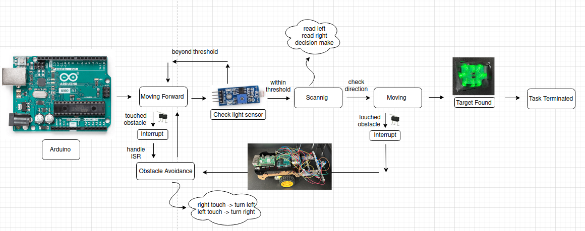

### CheckPoint 3
The purpose of Checkpoint 3 is to build a fully autonomous robot capable of executing movement logic, obstacle avoidance, and light tracking.

The robot operates in an arena consisting of a lighting puck (target) and a cone (obstacle) placed at the center, surrounded by four enclosing walls.

In this environment, the robot must locate the target while avoiding obstacles. It should execute predefined logic when encountering walls, and the task is considered complete once the robot successfully locates and reaches the target.

### flow diagram

### Unit tests
1. direct motor control using arduino
2. light sensor and touch sensor interfacing
3. touch sensor interrupt
4. touch sensor interrupt and motor motor control ISR
5. guuding robot using light sensor
6. integration
